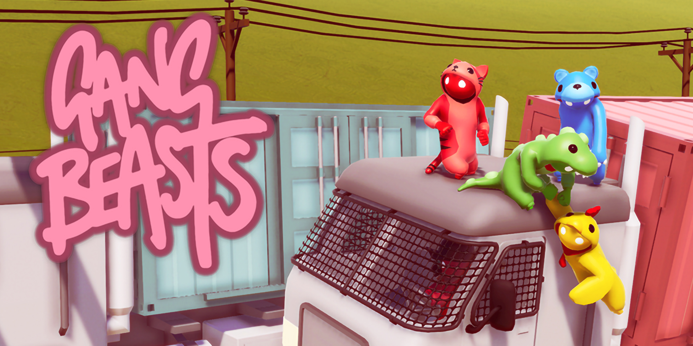
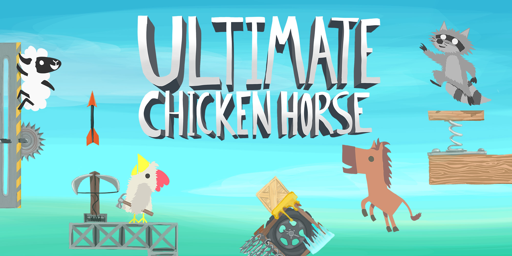

# Pirate Party Game
## Development Progress

---

# Overview

- Competitive multiplayer party game  
- Set on a stylised pirate island  
- Focus on chaos, social interaction, and replayability  

---

# Team Roles

- Collaborative group development  
- Shared responsibility across design and implementation  

- Role 1:
  - 3D modelling and environment creation  
  - Asset development (island, props)  

- Role 2:
  - Game Development

---

# Core Concept

- Fast-paced gameplay  
- Focus on player interaction  
- Emphasis on unpredictability and chaos

---

# Minigame Design

- Three core minigames  
- Each focuses on different player skills  
- Encourages variety, replayability and player retention

  

---

# Arena (PvP Minigame)

- Free-for-all combat on a pirate island  
- Weapons and coins spawn dynamically  
- Environmental hazards create unpredictability  
- Last player standing wins  

---

# Memory Minigame

- Players observe coin placements briefly  
- Coins disappear after a short time  
- Players estimate and input the total  
- Incorrect answers result in elimination  
- Last player standing wins  

---

# Quick Time Event Minigame

- Directional inputs appear on screen  
- Players must react within a time limit  
- Speed and difficulty increase over time  
- Incorrect or missed inputs result in loss of Health Points
- Last player standing wins  

---

# Why Our Minigames Work

- Each minigame tests different player skills  
- Encourages variety and replayability  
- Supports fast-paced gameplay loop  
- Creates unpredictable and engaging outcomes

---

# Research and Inspiration

- Focus on social interaction and unpredictability
- Emphasis on emergent gameplay

- Gang Beasts  
- Sea of Thieves  
- Ultimate Chicken Horse  

---

# Applying research to Design

- Arena:
  - Inspired by unpredictable multiplayer combat  
  - Dynamic weapons and hazards create an emergent and chaotic gameplay

- Memory:
  - Simple mechanics with competitive pressure  
  - Inspired by quick, social party challenges like Mario Party  

- QTE:
  - Reaction-based gameplay with increasing difficulty  
  - Keeps players engaged and under pressure

---

# Next Steps

- Finalise minigame mechanics  
- Improve player interaction  
- Expand asset library  
- Conduct playtesting and balancing  