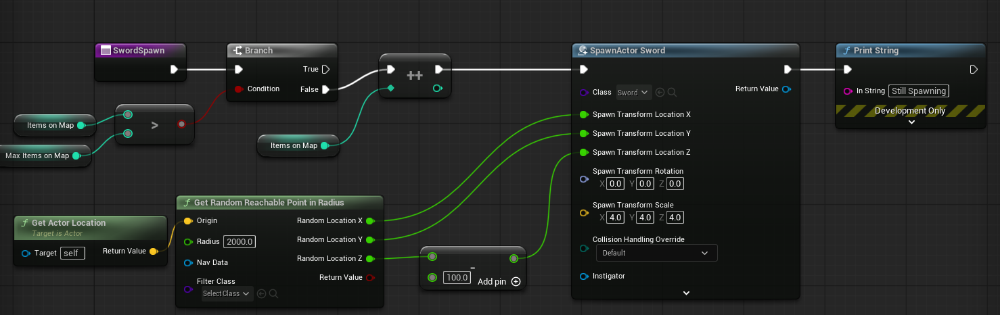
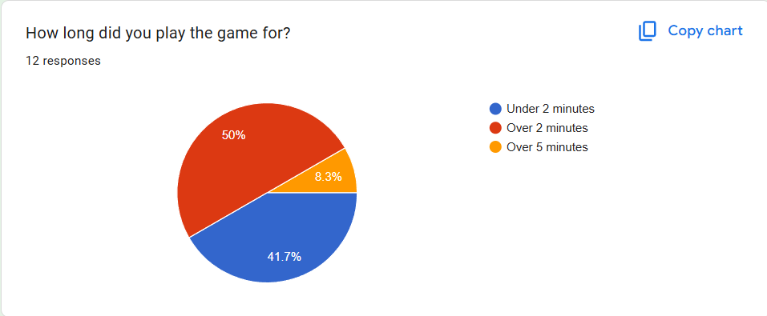
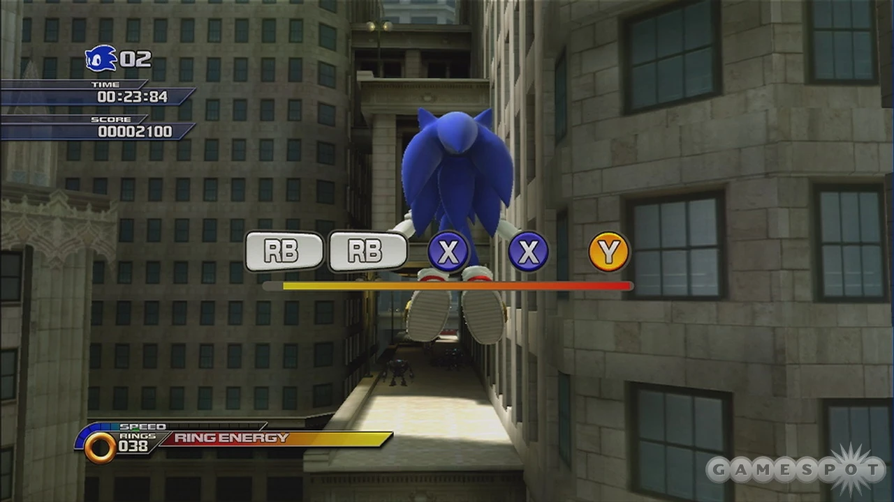
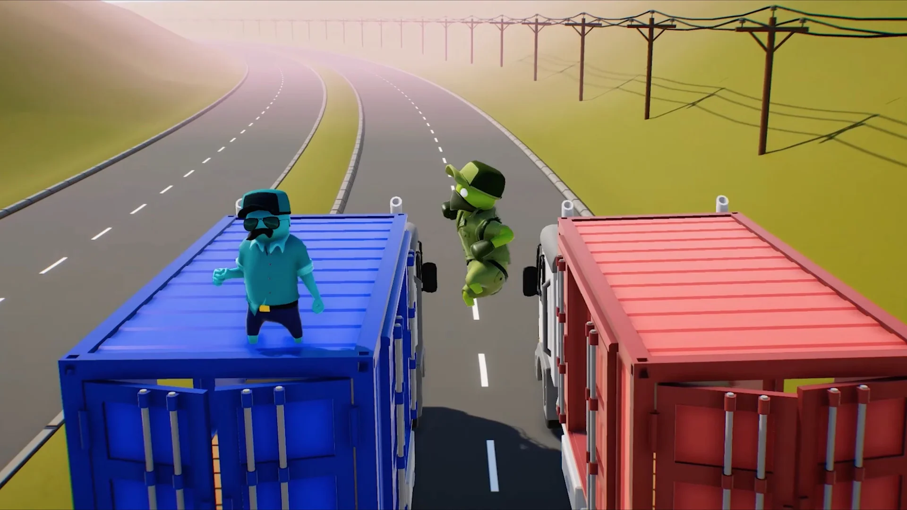
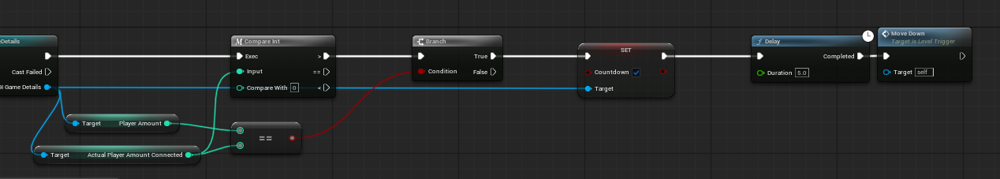
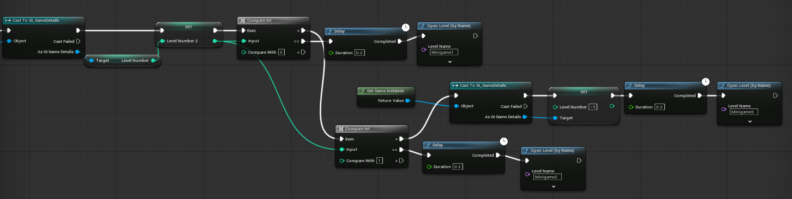
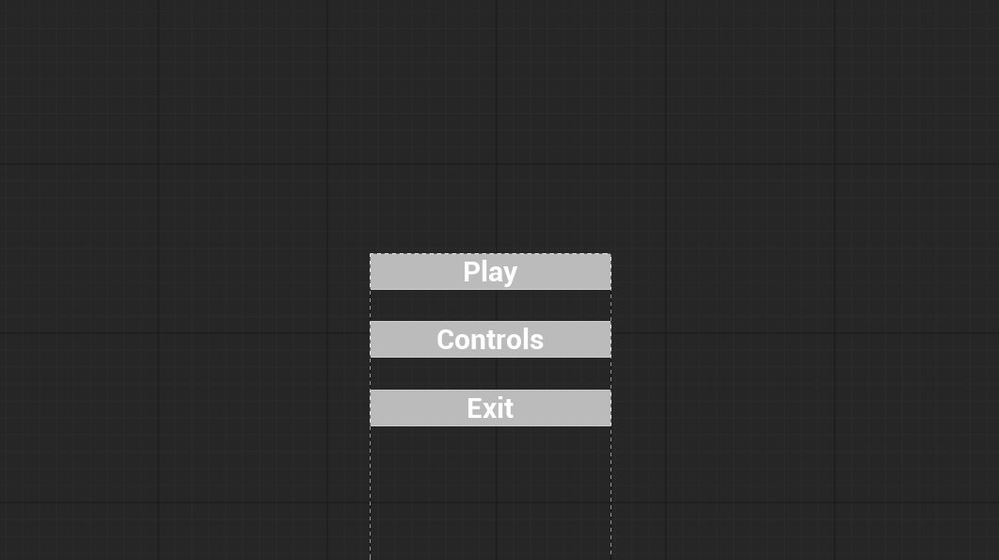
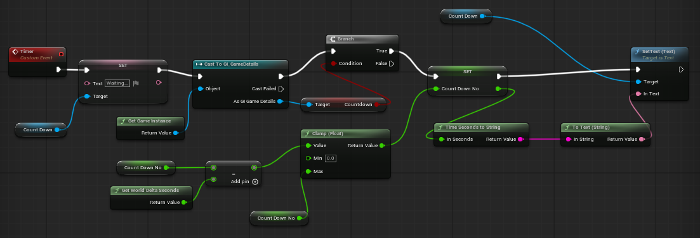

# Pirate Game

**Unit Name:** FGCT4016: Gameplay Design and Programming 25/26 

**Student Name:** Zuzanna Maria Pawelczyk

**Student ID:** 2506784 

**Total Word Count:** \[XXXX]

**API Reference Link:** \[URL]

**User Guide Link:** \[URL]

**Build Link:** \[URL or Embed]

**Video Demonstration Link:** \[URL or Embed]

---

## Abstract 

My goal is to create a 3D low-poly local multiplayer party game with three unique minigames with two other teammates working on the art side of the game, my personal task is to code a lobby, and the three minigames on Unreal Engine 5. My approach was to work out the very simpliest gameplay of the games before adding any complicated gamemodes.

The lobby would display how many wins each player has, as well as teleport each player into the minigames one by one, which in the final product i was able to do. I want every minigame to have a UI introducing to how the game works prior to playing the game. 

In the game the first minigame would a pvp map where the players can kill each other with a sword, a special gun that can be used once, block attacks with shields, avoid canon balls falling from the sky as well as collecting coins that can heal you in small amounts. The map would be inspired by an island, where the water is an instant death and a lava stream that slowly kills the player, once the player has died I want them to ragdoll and switch to a spectator mode. The map would also have areas where they can fall into a pitfull trap and loose a certain amount of health, to avoid the player getting stuck they can double jump to get out the trap.
In the final product I was able to create the pitfull trap, the sword and the coins to pick up for the player, I didnt have enough time to include a gun, a shield or avoiding canon balls. However, I was able to addd other environmental things like the water and the lava damaging as well as the ragdoll physics and spectator mode. 

The second minigame is a visual minigame where coins spawn in and the player is tasked with counting coins while ignoring other objects obscuring the coins and inputting the answer into the UI. There are six rounds and after six rounds the game will check for who is still left and give them both a point, if all but one player loose that one player gets a point. I was able to implement everything I wanted with this minigame. 

The third minigame is a QTE minigame where the player is given a direction they are required to click the correct button if they click the incorrect button they loose a life that is displayed on the ui, if the player clicks correctly they get a visual idication that they clicked correctly. Last player standing wins for all minigames. I was able to implement everything that i wanted for this minigame. 

---

## Research 

As a group we looked at different party games and focusing on their minigames, avoiding any minigames that would require online multiplayer as our game would entirely rely on local multiplayer. We looked at games such as Mario Party, Gang Beasts, Sea of Theives and Party Panic as well as I took certain minigame inspiration from Sonic Unleashed. 

### Game Sources

#### Party Panic:

Party Panic is a multplayer party game minigame with an initial release date of 2016 created by Everglow Interactive Inc. it's a game that is a party game similar to Mario party but with different minigames. This game manily inspired the lobby of my game. In Party Panic the players are in a lobby where the camera is pointed at all the players from a 3rd person where the players in a room and their points are displayed by a growing pillar beneath the player. I wanted to use a similar camera angle and but have the players movement be more limited within as well as have wins rather than points be displayed within the ui and not through a growing pillar. Despite the game being a party minigame we didnt explore the game's minigames as none are as interesting and didn't have as much potential to use as inspiration or they were inspired by Mario party already. 

#### Mario Party:

We looked through different Mario Party games (created by Nintendo) and minigames for inspiration, excluding any minigames that would require for the minigames to have teams (like 2v2 or 3v1) we wanted free for all minigames. The minigame we landed on that gave us the most inspiration was a Drop Quiz from Super Mario Party. It's visual style minigame where a certain amount of
Toads or Paratroopas move across a screen with or without fruit and one player picks a question for the other three to answer. The players have to walk over to different spots where the number matches with how many moved across the screen until a certain amount of questions is asked. Despite this being a 3v1 minigame originally we were able to translate it into a free for all, where the players have to specifically look for coins on a screen and count them and then input them on their ui element. Players every time are instructed to count coins rather than different questions each time, but with different amounts of coins and different objects blocking the coins.

#### Sonic Unleashed:

When looking for inspiration for the third minigame I was reminded of Sonic Unleashed for the Xbox 360 from 2009 made by Sega. How in the game there are certain segments that are Quick Time events. Upon clicking a random button that pops on screen you're able to progress in the game, and I took that as inspiration to make a rhythmn-like minigame, that you would be required to click any button the keyboard that pops up. I then realised that if I want the game to be compatible with a controller I had to reduce the buttons to just arrow keys like other rhythm game. 

#### Gang Beasts:

Gang Beasts released in 2017 by Boneloaf studios was our main inspiration behind map choices for our Pvp minigame. In Gang Beasts a unique aspect of the game is that the players are able to fight on maps that interact with the player, if its a train that drives past and can kill the player or break-able platforms underneath the players feet. With this I added things like the lava on the map being able to damage you over time if the player walks onto it as well as the entire water killing the player if they jump into it. On top of this I added traps, so it means the players have to be aware of the map and where they are walking as it will impact the game just like Gang Beasts does with it's maps. 

#### Sea of Thieves:

### Tutorial Sources

(How to Change/Load Levels - Unreal Engine 5 Tutorial) I used this video to help introduce me to creating different levels so that I could make seperate levels for the lobby and the three minigames. As well as learning about the "Open level" function so that I can switch between the levels. 

(How to Create a Game Instance in Unreal Engine 5 - Carry Data Between Levels) I used this video to help me be introduced to game instances that allow to carry information over between levels. This allows for the entire game to be aware of certain things without resetting between levels.

(How to Make a Simple Pick Up System in Unreal Engine 5 - Beginner Tutorial) I used this video to be to have the player pick up the sword and hold it, as well as I reused the tutorial for the gun in the Pvp Minigame. 

(Unreal-5: UI-Menu Display & Mouse Visibility!) I used this video to able to find how to show and hide the mouse to allow the player on the keyboard interact with certain parts of the menu.

(How to Make A True First Person Camera In Exactly 1 Minute!|UE6 & UE4) I used this video to help with the camera of the player as initally the camera moved seperately from the player meaning the player cant track their arms or legs so they cant track the sword. I wanted the camera to stick with the player head instead which this video helped me figure out. 

(How To Clamp The Camera Rotation | How to Lock The Camera View - Unreal Engine 4/5 Tutorial) I wanted to use this tutorial to fix my issue with the Camera not lining up with the player head, however this video didnt help as it only covered how to have the camera be clamped to moving up and down and not lock it onto the player overall.

(HITSCAN vs PROJECTILE | Explanation and Unreal Engine Implementation [UE4/UE5 EA2]) I used this video to learn how to make a hitscan gun, I ended up learning that hitscan uses the same line trace mechanic as my sword but it tracks the end of the gun and a has a long line trace to check if it overlaps with another player. 

(How to Make a Rnadom Enemy Spawner in Unreal Engine 5) I used this video to help me make sword spawning, initially i made the spawner a bunch of spawn blueprints but this video helped me instead make it rely on a nav mesh instead. I then reused the same method for coin spawning and gun spawning on the map.

(How To Spawn Items In Random Locations - Unreal Engine 4 Tutorial) Within Minigame 2 I had to spawn coins suspended in the air and not spawn on the ground so therefore I couldn't use a nav mesh, I instead used this video to refine how to spawn items through blueprint spawn points, I ran into some issues with the video but was able to fix them

(How To Put The Player In Spectator Mode When They're Dead - Unreal Engine Tutorial) I used this video to learn about the spectator actor and have the pvp players switch to posses the spectator actor instead. 

(Multiplayer Replication Basics in Unreal Engine 5 - Make a Multiplayer Game) I tried to use this video to learn how to make my gavme multiplayer and allow for multiple players, however this video only taught how to make online multiplayer when my focus was local multiplayer so this tutorial was useless.

(Multiplayer Widgets On One OR All Screens) I used this video to try and learn how to make the health display on each of the players screens, but unfortunately this video only focuses on online multiplayer and not local multiplayer therefore this didnt work. 

(How To Make A Countdown Timer | Unreal Engine 5 Tutorial) I used this video to learn how to make a countdown timer for my lobby and my Visual Minigame! 

(How To Make Gamepad Naivgation For Menu/UI Widgets In Unreal Engine 5) I used this video to try and make the menu work for both the keyboard users and the gamepad, however this didnt work really well as the menu only either wants to be used by the mouse or the gamepad and wont focus on both at the same time.

## Implementation 

### The Lobby
My progress started with working on the lobby and different Levels for each minigame to have a way to switch between the lobby and the two minigames. I created a Game Instance for the game to be able to track which minigame to send the player to through the "LevelTrigger" blueprint that on contact with a player sends the players to a new levels. LevelTrigger continiously checks if within the UI the amount of "Ready"'s are clicked are the same amount as players in the game as well as if the countdown has ended before moving the actor to overlap with the players. There is an integer that increases in different level game modes, and depending on the number of that integer it will send to a different minigame, after the third minigame the number resets.

Checking when to move and overlap the blueprint with the players:

The level change function:

Within the lobby I then added two different widgets for the UI, within the Level Blueprint for the lobby level it triggers the first widget which is the Main Menu, that pauses the game and allows the player to "Play" the game, check the "Controls" and "Exit" the game. I initally wanted the Main Menu to register with both mouse clicking and the controller however the two wouldn't work at the same time so I priotized the mouse, making sure that the mouse is shown during the menu. 

This Main Menu screen is then reused as a Pause Menu if the player click "P" or "Start" on the controller, it sets a boolean called "Playing?" if it has been used once and since then it will not redirect to the second Widget and just be used as a Pause Menu. If the Menu is used for the first time upon loading in pressing "Play" will unpause the game and spawn the second Widget in that tracks how many players there are playing and depending on how many there are the Widget requires for that many players to click "enter" or "start" to click Ready. A countdown will then trigger that updates every tick to countdown and once its zero the players are teleported to a minigame. 

The Countdown Timer:

### Pvp Minigame (Minigame 1)

## References:

#### Youtube Videos Used:

How To Change / Load Levels - Unreal Engine 5 Tutorial - YouTube (s.d.) At: https://www.youtube.com/watch?v=yj04QBEjc38&t=2s (Accessed  07/04/2026).

How to Create a Game Instance in Unreal Engine 5 - Carry Data Between Levels - YouTube (s.d.) At: https://www.youtube.com/watch?v=sWh1jgHb6Tw (Accessed  07/04/2026).

How to Make a Simple Pick Up System in Unreal Engine 5 - Beginner Tutorial - YouTube (s.d.) At: https://www.youtube.com/watch?v=qVtoemgM7wI&t=633s (Accessed  07/04/2026).

Unreal-5: UI-Menu Display & Mouse Visibility! - YouTube (s.d.) At: https://www.youtube.com/watch?v=JuzSB4Tg8BQ (Accessed  07/04/2026).

How To Make A True First Person Camera In Exactly 1 Minute! | UE5 & UE4 - YouTube (s.d.) At: https://www.youtube.com/watch?v=jkPxVScULh4 (Accessed  07/04/2026).

How To Clamp The Camera Rotation | How To Lock The Camera View - Unreal Engine 4/5 Tutorial - YouTube (s.d.) At: https://www.youtube.com/watch?v=hsBzIQfYZw0&t=96s (Accessed  07/04/2026).

HITSCAN vs PROJECTILE | Explanation and Unreal Engine Implementation [UE4/UE5 EA2] - YouTube (s.d.) At: https://www.youtube.com/watch?v=pWIJlsqli1w (Accessed  07/04/2026).

How To Spawn Items In Random Locations - Unreal Engine 4 Tutorial - YouTube (s.d.) At: https://www.youtube.com/watch?v=LfwQUGOQu2M&t=390s (Accessed  07/04/2026).

How to Make a Random Enemy Spawner in Unreal Engine 5 - YouTube (s.d.) At: https://www.youtube.com/watch?v=tf0BvCl11lE&t=226s (Accessed  07/04/2026).

How To Put The Player In Spectator Mode When They’re Dead - Unreal Engine Tutorial - YouTube (s.d.) At: https://www.youtube.com/watch?v=AN2PbE26mAk&t=235s (Accessed  07/04/2026).

Multiplayer Replication Basics in Unreal Engine 5 - Make a Multiplayer Game - YouTube (s.d.) At: https://www.youtube.com/watch?v=ef6SeknakeU&t=568s (Accessed  07/04/2026).

Multiplayer Widgets On One Or All Screens | Replication - Unreal Engine Tutorial - YouTube (s.d.) At: https://www.youtube.com/watch?v=2GYicrkCElA (Accessed  07/04/2026).

How To Make A Countdown Timer | Unreal Engine 5 Tutorial - YouTube (s.d.) At: https://www.youtube.com/watch?v=s6DF1fkwTE8 (Accessed  07/04/2026).

How To Make Gamepad Navigation For Menu/UI Widgets In Unreal Engine 5 - YouTube (s.d.) At: https://www.youtube.com/watch?v=RdaAVTMIg08&t=323s (Accessed  07/04/2026).

#### Where I got the Arrows from:
 
Arrow Symbols (Copy and Paste) ← ↑ → ↓ – Unicode Arrows & Arrow Emojis (s.d.) At: https://www.i2symbol.com/symbols/arrows (Accessed  07/04/2026).
